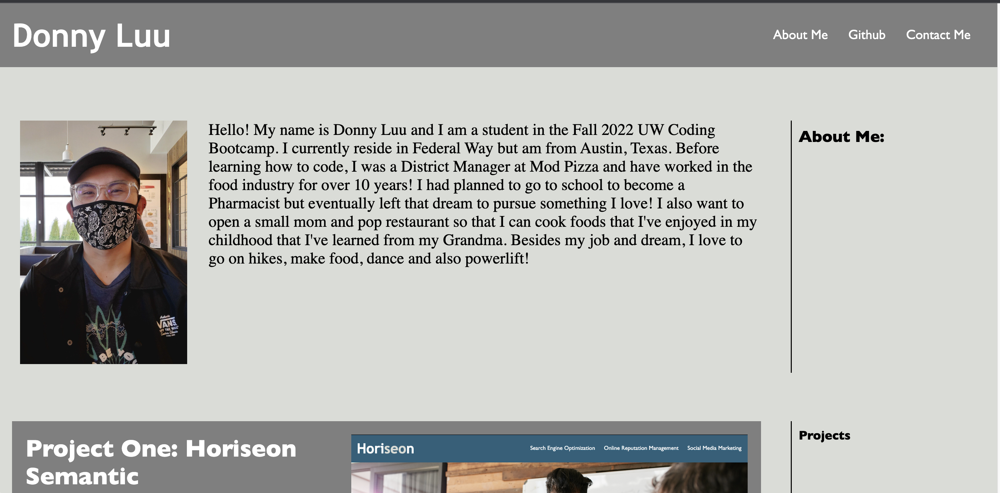

# Portfolio-Page
My portfolio about me, my work and how to contact me.

## Description

This project is a simple personal portfolio application that combines knowledge of both HTML and CSS. This portfolio is used for the developers journey throughout the bootcamp course. This will showcase skills and accomplishments of the developer for future employers.  The application was built using HTML, and CSS.

Key features include
* Navbar with clickable links for each application section along with links to external sources
* Semantic HTML elements for comprehension and accessibility
* Copyright notice
* Hover function for links and image 

### Links

[Link to the deployed website](https://luudonny.github.io/My-Portfolio-Page/)
[Link to the code repository](https://github.com/luudonny/My-Portfolio-Page)

## Installation

N/A

## Usage

## Credits
[Use of Style Sheet from w3schools for social media icons](https://www.w3schools.com/howto/howto_css_social_media_buttons.asp)

## License
Please refer to the LICENSE in the repo.

